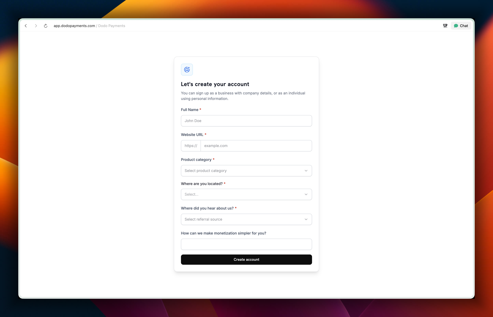
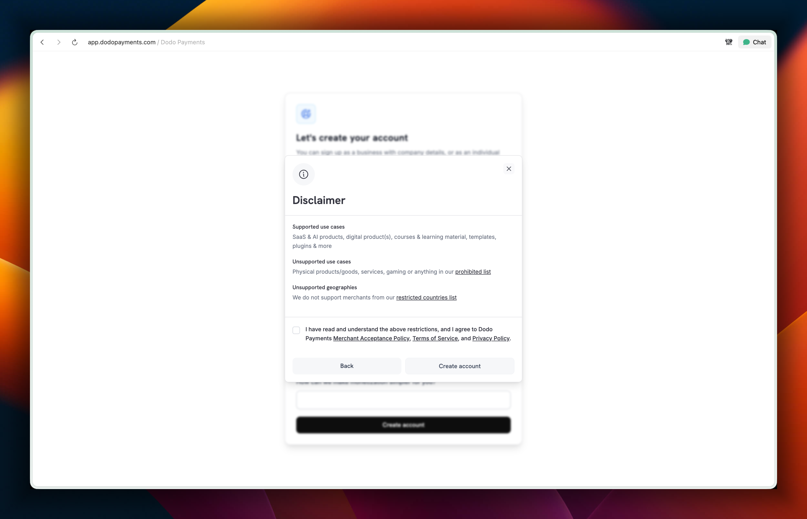
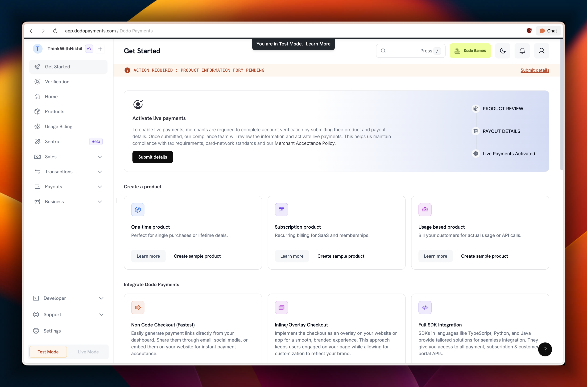
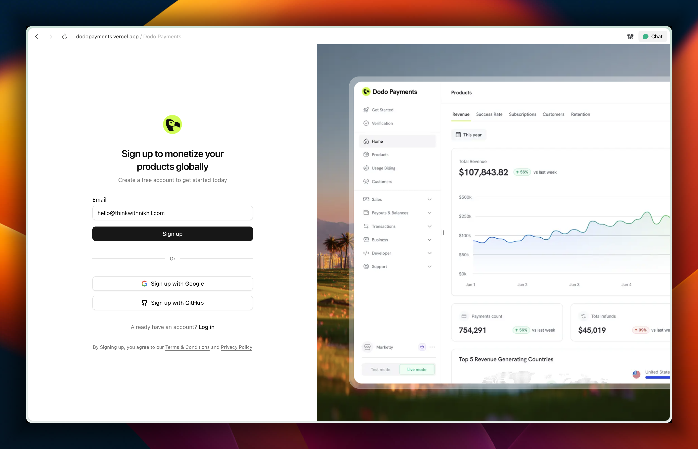
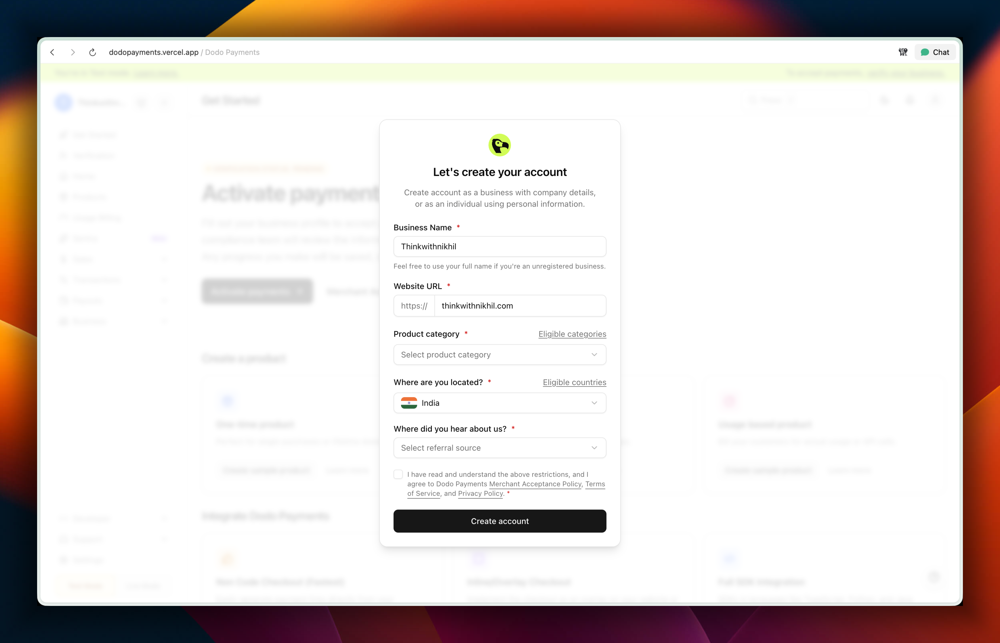
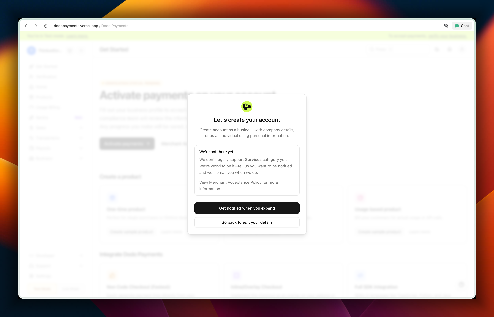
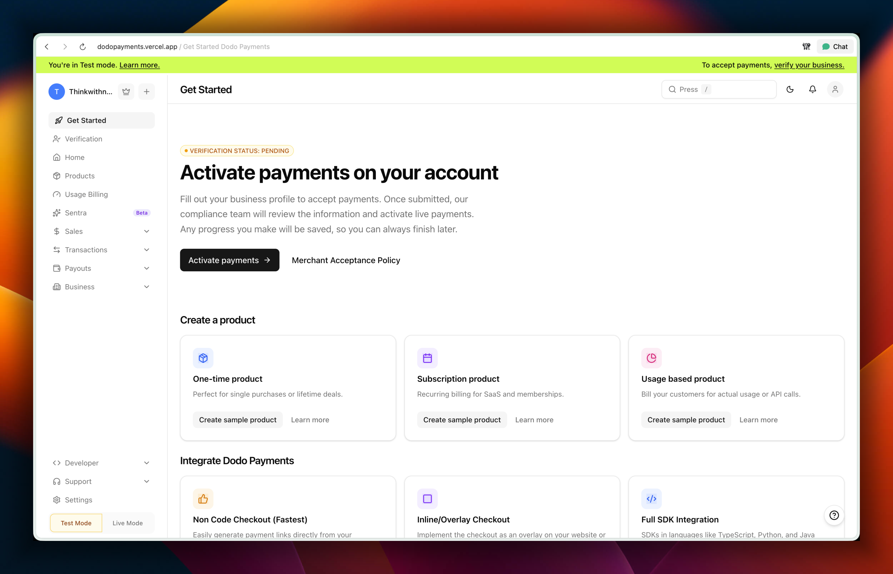

# Dodo Payments

Dodo Payments is a payments and billing platform that enables global payments for SaaS, AI, and digital products.

## User onboarding: case study

The purpose of Dodo's user onboarding is to help builders, indie hackers, and entrepreneurs quickly set up a billing system and start monetizing via a self-serve flow.

This onboarding revamp focuses on reducing the time between signup and account verification, lowering cognitive load, improving conversion at every step, and most importantly turning 'good enough' experience into 'unforgettable'.

### Let's take a look at current experience

<video src="public/demo/dodopayments-before.mp4" controls width="600"></video>

*Video: [dodopayments-before.mp4](public/demo/dodopayments-before.mp4)*

### Now let's deconstruct what's good and what went wrong

#### Sign up page


**Purpose:** Turn visitor into user.

**My note:**

- Overall, a pretty good signup page, but it doesn't do enough to establish trust or reinforce product value to nudge visitors to sign up. Right side visual is good, but not adding any value to the purpose of the page.
- Letter spacing in the title feels a bit loose, which makes the page look slightly sluggish.
- The subtext says "create account using email," but the UI shows Google and GitHub sign-up options, which makes the experience a bit confusing.

#### Create account form





**Purpose:** To capture initial set of crucial information, qualify user, and create an account.

**My note:**

- The form is collecting limited but critical information, which is good, but the subtext says this is about creating a business profile that can also be used as an individual—while the very first field is "Full name," which is ambiguous: is it the business name or the user's name?
- After filling all the information, another disclaimer appears with supported/unsupported categories and countries, followed again by a "Create account" button; this feels redundant and reads like a warning, as if I picked something unsupported.
- The "How can we help?" free-text field feels useless at this stage—most users don't know what to write; they just want to start monetizing their product.
- Overall, the screen feels too empty and underutilised.

#### Get started page



**Purpose:** To make user initiate the account verification process to enable payments, to unlock core product value. With a secondary priority to educate user about product features.

**My note:**

- Too many elements are competing for attention, which makes the page feel overwhelming and visually noisy.
- The content is hard to scan because of small font sizes and weak visual hierarchy.
- Product education is optimized to nudge user to read documentation to learn, instead of nudging users toward key actions that unlock value while they try.

### Let's take a look at reimagined version

**Try the revamped onboarding live:** [dodopayments.vercel.app](https://dodopayments.vercel.app)

<video src="public/demo/dodopayments-after.mp4" controls width="600"></video>

*Video: [dodopayments-after.mp4](public/demo/dodopayments-after.mp4)*

<video src="public/demo/dodopayments-unsupported-case.mp4" controls width="600"></video>

*Video: [dodopayments-unsupported-case.mp4](public/demo/dodopayments-unsupported-case.mp4)*

### Now let's deconstruct what's changed and why

#### Sign up page



**What's changed and why:**

- **Copy anchored in jobs-to-be-done and motivation psychology:** The headline and subtext now frame signup as a way to "start charging for your product" rather than "create an account." This taps into goal-gradient and relevance bias—users are more likely to act when they see a direct line from this step to their desired outcome.
- **Auto-focused email field to lower friction and boost momentum:** As soon as the page loads, the cursor drops into the email field, so users can start typing without thinking. This reduces cognitive load, cuts a micro-decision ("where do I start?"), and uses momentum bias—once they begin typing, they're more likely to complete the flow. The tiny speed gain also makes the experience feel snappier and more premium.
- **Product visual to build trust, reduce uncertainty, and prime value:** A focused product shot on the right shows what the dashboard actually looks like before signup. This leverages social proof and fluency: seeing a polished, concrete interface makes the product feel real, trustworthy, and worth the effort. It also reinforces the promise in the copy—users can literally see the "after" state they're signing up to unlock.

#### Create account form





**What's changed and why:**

- The create account form now sits on top of a blurred dashboard, with logo and branding. This creates a small curiosity gap, feels more on-brand than a plain white background, and makes the step feel closer to "inside the product," which nudges users to continue.
- "Full name" is now "Business name," since this step is really about setting up the business profile and moving closer to monetization. A helper text lets users know they can just use their own name if they don't have a registered business yet.
- If the user signs up with a business email, the form smartly pre-fills the business name and website URL from the email domain. Uses Hick's Law and principle of least effort. Less typing, faster path to the next step.
- Country is prefilled based on IP, so users only need to change it if it's wrong. The idea is to minimise manual work and keep momentum.
- Links to eligible categories and locations sit right next to the relevant fields, so users can quickly check if they're supported without breaking flow.
- Instead of a generic disclaimer after hitting "Create account," the form now shows contextual messages only when a user picks an unsupported category or location. This keeps the happy path clean while still capturing interest from unsupported segments and using that signal to shape the roadmap. No dead ends—users can opt in to be notified when support expands.
- Terms are shown inline on the form itself, removing the need for an extra, redundant disclaimer screen.

#### Get started page



**What's changed and why:**

- Test mode banner is now on-brand with action-oriented copy. Instead of just saying "You're in test mode," it also tells you what to do next — verify your business to start accepting payments. It turns a passive label into a subtle nudge towards activation.
- The old loud "action required" treatment is replaced with a calmer "Pending" status tag. This reduces visual noise and removes the sense of "something is broken," while still keeping the state visible.
- "Activate payments" is pulled front and center with larger type and a cleaner layout, so it's obvious what the next step is and why it matters.
- Product education is tilted towards learn-by-doing. "Create sample product" becomes the primary CTA, while "Learn more" is secondary — encouraging users to try things inside the product instead of falling into a docs rabbit hole.

### Why it matters

Good enough gets people in the door; unforgettable is what makes them stay and tell others. This revamp keeps the same goal—get builders from signup to monetizing as quickly as possible—but reshapes the flow so every step feels intentional and supportive. Users get clarity and momentum; we get higher intent, better data, and a first experience that sets the tone for the rest of the product.

---

## Getting Started

This is a [Next.js](https://nextjs.org) project bootstrapped with [`create-next-app`](https://nextjs.org/docs/app/api-reference/cli/create-next-app).

First, run the development server:

```bash
npm run dev
# or
yarn dev
# or
pnpm dev
# or
bun dev
```

Open [http://localhost:3000](http://localhost:3000) with your browser to see the result.

You can start editing the page by modifying `app/page.tsx`. The page auto-updates as you edit the file.

This project uses [`next/font`](https://nextjs.org/docs/app/building-your-application/optimizing/fonts) to automatically optimize and load [Geist](https://vercel.com/font), a new font family for Vercel.

## Learn More

To learn more about Next.js, take a look at the following resources:

- [Next.js Documentation](https://nextjs.org/docs) - learn about Next.js features and API.
- [Learn Next.js](https://nextjs.org/learn) - an interactive Next.js tutorial.

You can check out [the Next.js GitHub repository](https://github.com/vercel/next.js) - your feedback and contributions are welcome!

## Deploy on Vercel

The easiest way to deploy your Next.js app is to use the [Vercel Platform](https://vercel.com/new?utm_medium=default-template&filter=next.js&utm_source=create-next-app&utm_campaign=create-next-app-readme) from the creators of Next.js.

Check out our [Next.js deployment documentation](https://nextjs.org/docs/app/building-your-application/deploying) for more details.
